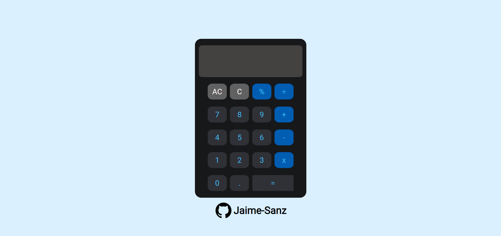

# Calculator
Following `The Odin Project` this is the calculator project.
## Preview
|  |
|----|

For those who would like to run the application and/or edit its source code on their local computer, follow the steps below:

1. Clone the repository with `git clone https://github.com/Jaime-Sanz/Calculator` or download it as a .zip file and extract it.
2. Navigate to where the repository is saved on your local machine and open its index.html file on your preferred web browser.

# Usage
- to make simple calculations

> Note
>
>> [A live deployment of the calculator is available on GitHub pages](https://jaime-sanz.github.io/Calculator/)

# Built Using
> 

# Contributing
Feel free to submit an issue should a bug be found using the application.

# Contact Info
> Send a message by clicking on the icon!
> 
> 
